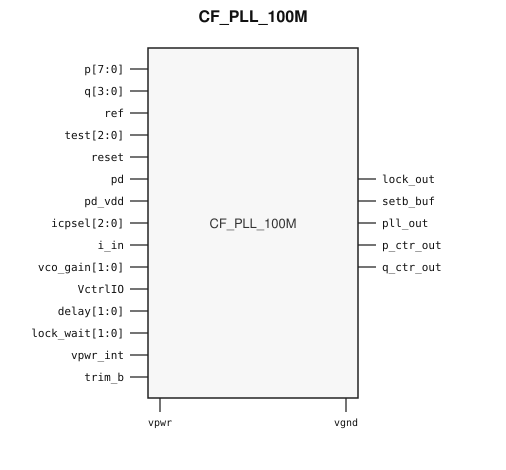

# CF_PLL_100M

> 100 MHz PLL

The public GDS is an abstract; ChipFoundry
substitutes protected full geometry at tapeout.

This package ships an SRAM-style PG wrap `CF_PLL_100M` around analog leaf
`CF_PLL_100M_core`.

## Overview

`CF_PLL_100M` is a SkyWater 130 nm hard-macro PLL that synthesizes a system
clock up to 100 MHz from a lower-frequency reference. Instantiate `CF_PLL_100M`.

Macro size is 453.405 × 384.06 µm (15 µm halo around analog leaf
423.405 × 354.06 µm). Customer PG for chip PDN is `vpwr` / `vgnd`. Analog
supply `vpwr_int` stays a wrap port and is routed as a signal. N-well `nwl`
and substrate `sub` are tied inside the wrap.

## Installation

```bash
pip install cf-ipm
ipm install CF_PLL_100M --version 0.2.0
```

Use `hdl/gl/CF_PLL_100M.v` as the customer blackbox, `layout/lef/CF_PLL_100M.lef`
for P&R, and `layout/gds/CF_PLL_100M.gds` / `layout/mag/CF_PLL_100M.mag` for the
public wrap. `CF_PLL_100M_core` is the analog leaf (empty Verilog, pin-only
abstract). ChipFoundry substitutes vault GDS into `CF_PLL_100M_core` at tapeout.
P&R uses the wrap LEF (`vpwr` / `vgnd` for chip PDN).

Functional sim compiles `verify/beh_model/CF_PLL_100M_core.v` **instead of** the empty `hdl/gl/CF_PLL_100M_core.v` stub. See `verify/beh_model/README.md`.

## Features

- Reference input `ref` and system clock output `pll_out`
- Feedback divider `p[7:0]` and reference divider `q[3:0]`
- Lock flag `lock_out`, divider monitors `p_ctr_out` / `q_ctr_out`
- Power-down `pd` / `pd_vdd` and `reset`
- Charge-pump select `icpsel[2:0]`, bias `i_in`, and VCO gain `vco_gain[1:0]`
- Analog control `VctrlIO`, delay `delay[1:0]`, lock wait `lock_wait[1:0]`, test `test[2:0]`, trim `trim_b`, and buffered set `setb_buf`
- Analog supply `vpwr_int` (wrap signal port)
- Ideal Verilog behavioral model under `verify/beh_model/` for functional sim
- Customer cell `CF_PLL_100M` 453.405 × 384.06 µm (15 µm halo around analog leaf 423.405 × 354.06 µm)
- Chip PDN is `vpwr` / `vgnd`

## Pinout

Customer documentation includes a pinout of the integration cell only.
Internal schematics and architecture block diagrams are not published.



Pin names and directions match the public wrap (`layout/lef/CF_PLL_100M.lef`)
and the blackbox stub (`hdl/gl/CF_PLL_100M.v`).

## Pin Description

Directions and widths are taken from the shipped Verilog in `hdl/gl/CF_PLL_100M.v`.

| Name | Direction | Width | Description |
|---|---|---:|---|
| `p` | input | 8 | Feedback divider code. |
| `q` | input | 4 | Reference divider code. |
| `ref` | input | 1 | Reference clock. |
| `test` | input | 3 | Test mode. |
| `reset` | input | 1 | Reset. High holds the clocks and lock low in the ideal model. |
| `pd` | input | 1 | Power-down. |
| `pd_vdd` | input | 1 | Supply power-down. |
| `icpsel` | input | 3 | Charge-pump current select. |
| `i_in` | input | 1 | Bias current input. |
| `vco_gain` | input | 2 | VCO gain select. |
| `VctrlIO` | inout | 1 | Analog VCO control. Route as a signal; not on chip PDN. |
| `delay` | input | 2 | Lock-delay select. |
| `lock_wait` | input | 2 | Lock-wait select. |
| `vpwr` | input | 1 | Digital supply. |
| `vpwr_int` | input | 1 | Internal analog supply. Route as a signal; not on chip PDN. |
| `vgnd` | input | 1 | Ground. |
| `lock_out` | output | 1 | Lock flag. |
| `setb_buf` | output | 1 | Buffered set. |
| `pll_out` | output | 1 | Synthesized clock. |
| `p_ctr_out` | output | 1 | Feedback-divider monitor. |
| `q_ctr_out` | output | 1 | Reference-divider monitor. |
| `trim_b` | input | 1 | Trim. |

`CF_PLL_100M_core` also has n-well `nwl` and substrate `sub`. The wrap ties
`.nwl(vpwr)` and `.sub(vgnd)`. Do not connect those pins at chip level.

In OpenLane / LibreLane, hook chip PDN with
`PDN_MACRO_CONNECTIONS: "u_cf_pll_100m vccd1 vssd1 vpwr vgnd"` and connect
`.vpwr(vccd1)`, `.vgnd(vssd1)` under `USE_POWER_PINS`. Route `vpwr_int` and
`VctrlIO` onto `analog_io`.

## Specifications

This PLL is intended to synthesize a system clock up to 100 MHz from a
lower-frequency reference. No Liberty timing file ships with this package.
This README does not invent PVT tables.

## Timing Diagram

The ideal model in `verify/beh_model/` is the functional timing reference for
simulation. `pd`, `pd_vdd`, or `reset` high clears `pll_out` and `lock_out`.
With those pins low, `lock_out` rises after eight `ref` edges, and `pll_out`
toggles at the reference frequency times `p / q`. That model is not
silicon-verified.

## Limitations and Open Issues

- Verilog in `hdl/gl/CF_PLL_100M.v` is a structural wrap around an empty
  `CF_PLL_100M_core` blackbox. Functional sim uses `verify/beh_model/CF_PLL_100M_core.v` (ideal model, not SPICE).
- Liberty is not in this package. P&R uses the wrap LEF.
- Charge-pump, VCO gain, delay, test, trim, and `VctrlIO` are not modeled.

## Release History

| Version | Date | Notes |
|---|---|---|
| 0.2.0 | 2026-09-26 | First SRAM-style PG-wrapped package. Ideal behavioral model. Core fill-exclude covers. |

## Tapeout History

This hard macro has high-volume commercial production history (millions of
units). Catalog and IPM maturity is Production. ChipFoundry substitutes
protected full layout at tapeout. The chipIgnite delivery of this package is
not marked shuttle-proven until a run returns.
